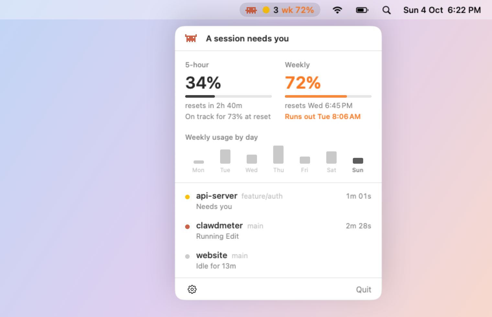

# clawdmeter

A tiny menu bar app for Claude Code on Mac. See at a glance whether Claude is working or waiting for you, and how much of your usage limits you have left.

<picture>
  <source media="(prefers-color-scheme: dark)" srcset="assets/hero-dark.png">
  
</picture>

## Install

You need **macOS 26 (Tahoe) or later** and [Claude Code](https://claude.com/claude-code).

Open **Terminal**, paste this line, and press Return:

```sh
curl -fsSL https://raw.githubusercontent.com/tangheng05/clawdmeter/main/install.sh | sh
```

That's it. An orange Clawd appears in your menu bar. Send a message in Claude Code and it starts tracking.

<details>
<summary>Prefer to download it yourself?</summary>

1. Download **Clawdmeter.zip** from the [latest release](https://github.com/tangheng05/clawdmeter/releases/latest).
2. Open the zip and drag **Clawdmeter** into your **Applications** folder.
3. Open it. macOS will say it can't check the app for malicious software, because this free app isn't registered with Apple. Click **Done**, then go to **System Settings → Privacy & Security**, scroll down, and click **Open Anyway**.

</details>

## What the menu bar shows

Clawd acts out what Claude is doing:

| Clawd | It means |
| --- | --- |
| Scuttling | Claude is working |
| Waving its claws, with a yellow dot | A session needs you, like a permission question |
| Dozing with a little z | Everything is idle |
| A quick hop | A task just finished |
| A blue sweat drop | You've used 90% or more of a limit |
| Faded | No Claude Code sessions are open |

Next to Clawd, `wk 86%` shows whichever limit is closest to running out (`5h` or `wk`). It turns amber at 70% and red at 90%. A number like `2` shows how many sessions are open.

## The popover

Click Clawd to see:

- **Both limits** with their reset times, and a forecast for each: on track, or when you'll run out at your current pace.
- **Your week so far:** a bar for each day's share of the weekly limit.
- **Every session** with its folder, git branch and what it's doing. **Click a session to jump to it.** Terminal and iTerm2 open the exact tab (macOS asks once for permission), tmux switches to the right pane, VS Code, Cursor and Zed open the project window, and other apps come to the front.

The gear menu has the settings, including **Launch at login** so Clawdmeter is always there when you start your Mac.

## Notifications

Clawdmeter can tell you when:

- a task that took 30 seconds or more finishes,
- a session needs your answer,
- a limit reaches 80% or 95%, or resets after heavy use.

It stays quiet when you're already looking at that session. Click a notification to jump to the session. Choose which ones you want, and whether they play a sound, from the gear menu.

## What it changes on your Mac

The first time it opens, Clawdmeter connects itself to Claude Code by adding a status line and a few hooks to `~/.claude/settings.json`. A backup of that file is saved next to it first.

You'll notice a short line at the bottom of Claude Code showing your model, folder and usage. If you already had your own status line, it keeps working as before.

Clawdmeter uses no Claude tokens and never goes online. Everything stays on your Mac.

## Troubleshooting

**No notifications.** Open **System Settings → Notifications → Clawdmeter** and allow them.

**Clicking a session doesn't open the right tab.** Allow Clawdmeter under **System Settings → Privacy & Security → Automation**.

**No sessions show up.** Send a message in Claude Code, or start a new session. Sessions that were open before you installed appear once they do something.

**"Usage limits show up after your next Claude Code message."** Send a message and they appear. Limits are only available when you sign in to Claude Code with a Claude subscription, not with an API key, Bedrock or Vertex.

**The usage numbers look faded.** They haven't been updated for over 10 minutes. They refresh the next time Claude replies.

**"Clawdmeter can't be opened."** Go to **System Settings → Privacy & Security** and click **Open Anyway**.

## Update

Run the install command again.

## Uninstall

1. Click Clawd, then the gear, then **Remove Claude Code integration**.
2. Click **Quit**, and drag **Clawdmeter** from Applications to the Trash.

## Build from source

```sh
git clone https://github.com/tangheng05/clawdmeter.git
cd clawdmeter
make install   # build and install into Applications
swift test     # run the tests
```

## License

MIT
