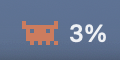
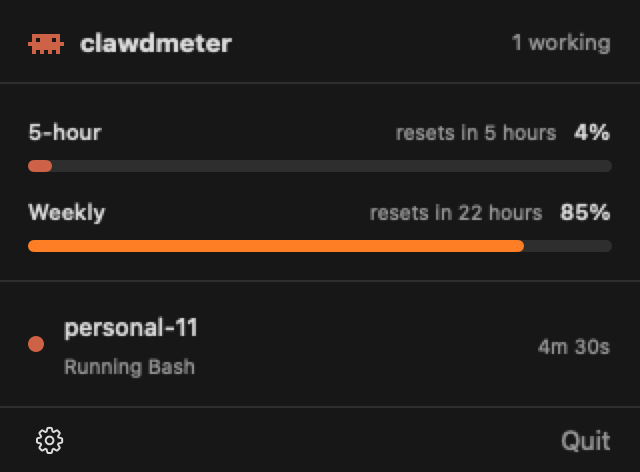

# clawdmeter

A tiny macOS menu bar app for Claude Code. See whether Claude is working or waiting on you, and how much of your 5-hour and weekly limits you've used.

 <br>


- **Live status:** Clawd scuttles while any session is working, and a yellow dot appears when one needs you.
- **Every session:** project, what it's doing (`Running Bash`, `Thinking`, `Needs you`), and how long it's been at it.
- **Usage limits:** 5-hour and weekly usage with reset times, straight from Claude Code.
- **Close to zero energy use:** no polling. Updates come from FSEvents and kernel process-exit events, and the animation runs in Core Animation, so the app stays asleep even while the icon moves.
- **No dependencies:** no Node, no Python. One small native helper handles the hooks.

## Install

Requires macOS 26+ and Xcode command line tools.

```sh
git clone https://github.com/tangheng05/clawdmeter.git
cd clawdmeter
make install
```

On first launch it hooks into Claude Code (see below). Sessions show up the next time they do something.

## How it works

- **Status** comes from `~/.claude/sessions/*.json`, which Claude Code writes itself.
- **Tool activity** comes from a few Claude Code hooks that write `~/.claude/clawdmeter/hooks/<session>.json`.
- **Limits** come from Claude Code's statusline input (`rate_limits`), saved to `~/.claude/clawdmeter/limits.json`. If you already had a statusline, it still runs and its output is unchanged. Otherwise you get a compact `Opus · project · 5h 4% · wk 85%` line.

Setup backs up `~/.claude/settings.json` first, never touches a file it can't parse, and leaves your own hooks alone. Remove it any time from the gear menu ("Remove Claude Code integration").

Limits aren't available with API-key, Bedrock or Vertex auth.

## Development

```sh
swift test     # core logic tests
make app       # build build/Clawdmeter.app
```

## Credits

Inspired by [gmr/claude-status](https://github.com/gmr/claude-status) and [m1ckc3s/claude-status-bar](https://github.com/m1ckc3s/claude-status-bar).

Unofficial and not affiliated with Anthropic. "Claude" is a trademark of Anthropic.

## License

MIT
