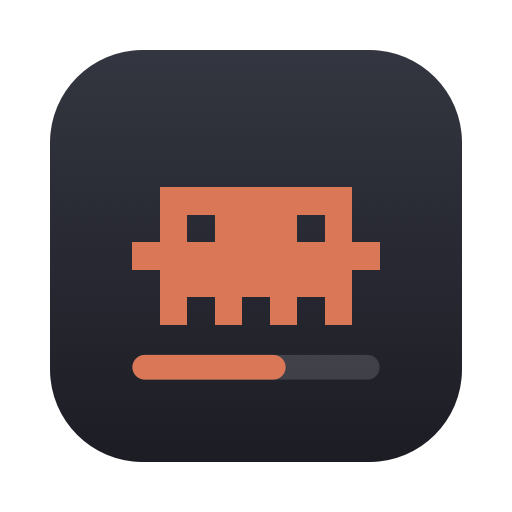
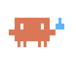

<p align="center">
  
</p>

<h1 align="center">clawdmeter</h1>

<p align="center">
  A tiny Clawd in your Mac menu bar that shows what Claude Code is doing,<br>
  and how much of your usage limits you have left.
</p>

<p align="center">
  <a href="https://github.com/tangheng05/clawdmeter/releases/latest"></a>
  
  
</p>

<picture>
  <source media="(prefers-color-scheme: dark)" srcset="assets/hero-dark.png">
  
</picture>

## Install

You need **macOS 26 or later** and [Claude Code](https://claude.com/claude-code). Open **Terminal**, paste this, and press Return:

```sh
curl -fsSL https://raw.githubusercontent.com/tangheng05/clawdmeter/main/install.sh | sh
```

Clawd appears in your menu bar, and a short welcome screen helps you finish setting up.

<details>
<summary>Other ways to install</summary>

**Homebrew:** `brew install --cask tangheng05/tap/clawdmeter`. Already installed it another way? Add `--adopt` so Homebrew takes over your existing copy.

**Download:** get **Clawdmeter.zip** from the [latest release](https://github.com/tangheng05/clawdmeter/releases/latest) and drag the app into Applications. The first time you open it, macOS blocks it because this free app isn't registered with Apple: go to **System Settings → Privacy & Security** and click **Open Anyway**.

</details>

## Meet Clawd

Clawd acts out what Claude is doing, so you can tell at a glance.

<table>
  <tr>
    <td align="center" width="25%"><br><b>Working</b><br>Scuttles</td>
    <td align="center" width="25%"><br><b>Needs you</b><br>Waves, with a yellow dot</td>
    <td align="center" width="25%"><br><b>Compacting</b><br>Squishes down</td>
    <td align="center" width="25%"><br><b>Done</b><br>Hops when a longer task ends</td>
  </tr>
  <tr>
    <td align="center"><br><b>Idle</b><br>Blinks, ready to go</td>
    <td align="center"><br><b>Near a limit</b><br>Sweats at 90%</td>
    <td align="center"><br><b>No sessions</b><br>Falls asleep</td>
    <td></td>
  </tr>
</table>

Next to Clawd, `wk 86%` is the usage limit closest to running out. It turns amber at 70% and red at 90%.

## What you can do

- **See your limits.** Click Clawd (or press **⌃⌥⌘C**) for your 5-hour and weekly usage, when each resets, and whether you're on pace to run out.
- **Keep track of every session.** Each one shows its folder, branch, what Claude is doing and how full its context is. Click it to jump straight to its terminal or editor.
- **Get notified** when a long task finishes, a session needs your answer, or a limit gets close.
- **Make it yours** in Settings (the gear, or ⌘,): what shows in the menu bar, which notifications you get, and your own keyboard shortcut.

## Good to know

- **Private.** Everything stays on your Mac and it uses no Claude tokens. It only goes online to check for updates once a day.
- **Light.** Clawd uses close to 0% CPU, even while it moves.
- **Updates itself.** When a new version is out, click **Update** in the popover. With Homebrew, run `brew upgrade clawdmeter`.
- **Connects to Claude Code** by adding a status line and a few hooks to `~/.claude/settings.json`, after saving a backup. Your own status line keeps working.
- **Works in the terminal and in VS Code.** Usage limits refresh from terminal sessions, and they need a Claude subscription login, not an API key.

<details>
<summary>Something not working?</summary>

**Don't see Clawd?** Press ⌃⌥⌘C. On MacBooks with a notch, it may be hidden behind it; check **System Settings → Menu Bar**.

**No sessions?** Send a message in Claude Code, and the session appears.

**No notifications?** Turn them on in **System Settings → Notifications → Clawdmeter**.

**A session click opens the wrong tab?** Allow Clawdmeter in **System Settings → Privacy & Security → Automation**.

**Usage looks faded?** It hasn't updated for 10 minutes. It refreshes the next time Claude replies.

</details>

## Uninstall

Open Settings, click **Disconnect** under Claude Code, then quit Clawdmeter and move it to the Trash. With Homebrew: `brew uninstall --zap clawdmeter`.

Already deleted the app? Run `~/.claude/clawdmeter/bin/clawdmeter uninstall` in Terminal.

<details>
<summary>Build from source</summary>

```sh
git clone https://github.com/tangheng05/clawdmeter.git
cd clawdmeter
make install   # build and install into Applications
swift test     # run the tests
```

</details>

## License

MIT
